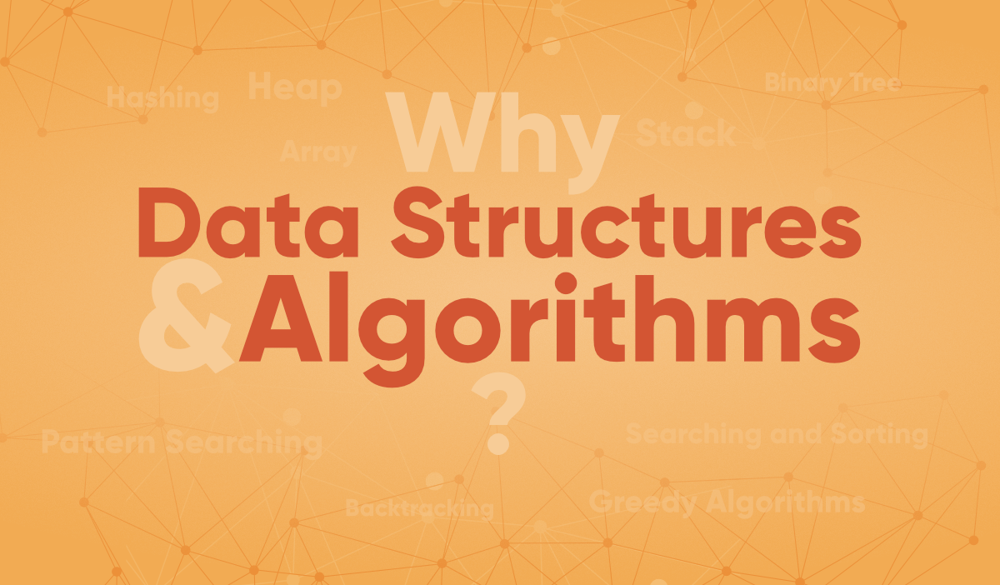
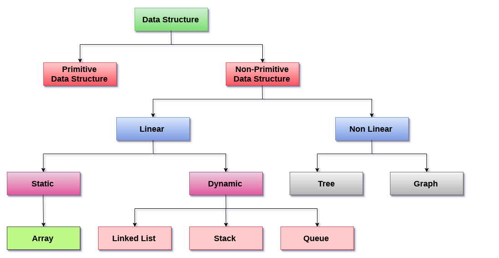

# Data Structure And Algorithm In Java

# Why there is need of Data Structures?
The needs of data structures include the following: 
* Efficiency
* Reusability
* Invisibility. 

Data structure provides a means of 
* organizing
* managing 
* storing data efficiently. 
* It also includes the collection of data as well as the operations that can be applied to that data.

